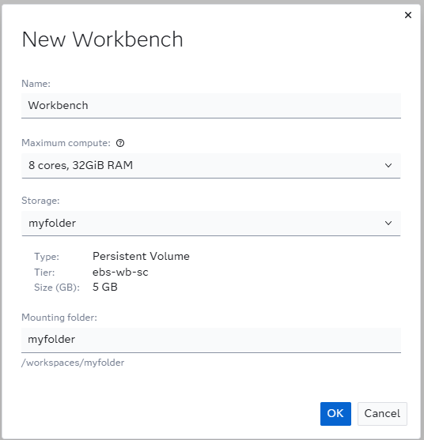
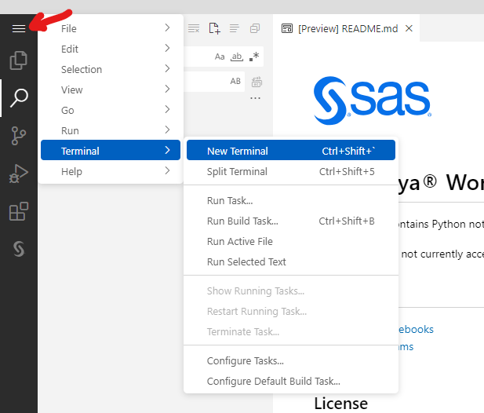

# SAS Viya Workbench Workshop
This repository contains all the relevant material for successfully following the SAS Viya Workbench Workshop.

## Accessing the Material:

1. Create a workbench.


2. Configure your workbench in the following way.



3. Start your workbench instance.


4. Once the workbench is running, press **Open Visual Studio Code**

5. Open a **New Terminal**.



6. Type:
```bash
git clone https://github.com/fabiocerutisas/Live-SAS-WorkbenchWorkshop.git
```
## Repository Structure
### Data
It is a folder containing all the necessary data for the workshop. It is characterized by 2 folders:
- original_data: a folder containing the required 3 datasets for the workshop.
- cleaned_data: a folder containing the cleaned data as a result of the SAS Code.

### Img
It is a folder containing all the relevant documentation screenshots that are embedded in both the sasnb and ipynb notebooks.

### Python
It contains 3 python notebooks:
- overview_modelling.ipynb: It is a notebook containing an overview of ML Modelling in Python using both Sk-learn and Sasviya.ml.
- overview_scoring.ipynb: It imports Python ML Models created in overview_modelling.ipynb and scores data with them.
- connect_to_viya.ipynb: It registers the developed models in Model Manager.

### SAS
It contains 4 folders and 7 SAS Notebooks.
The folders available are:
- astore: containing the astore of the ML models that will be developed.
- format: storing the user-defined formats for different variables.
- generated_code: containing code to replicate WOE Transformations and Score new data.
- sas_tables: storing all the SAS Tables generated during the workshop.

The notebooks available are:
- 0_setup.sasnb: in which the key macro variables, functions and formats are defined.
- 1_data_import_and_cleaning.sasnb: the notebook walks through data cleaning and exploration.
- 2_data_analysis.sasnb: the notebook contains data analysis activities related to correlations and clustering.
- 3_ml_data_prep.sasnb: it prepares data for ML Modelling by applying WOE Transformations.
- 4_modelling.sasnb: creates and assess ML Models
- 5_score_new_data.sasnb: scores data with the previously created SAS ML Models.
- 6_connect_to_viya.sasnb: registers a developed model in Model Manager.
